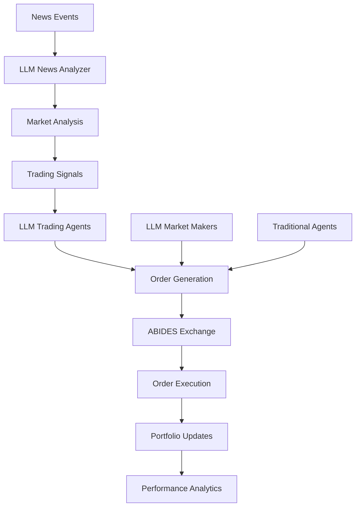

# ABIDES-LLM Integration: Complete Experimental Framework

[](https://www.python.org/downloads/)
[](https://github.com/jpmorganchase/abides-jpmc-public)
[](https://opensource.org/licenses/MIT)

A comprehensive integration of Large Language Model (LLM) reasoning with the ABIDES (Agent-Based Interactive Discrete Event Simulation) experimental framework for realistic financial market simulation.

## 🚀 Quick Start

```bash
# 1. Clone this repository
git clone <your-repo-url>
cd abides-llm-integration

# 2. Run automated setup
python setup_abides_llm.py --verbose

# 3. Set your OpenAI API key
export OPENAI_API_KEY="your-api-key-here"

# 4. Run example simulation
python example_run.py
```

## 📋 Table of Contents

- [Overview](#overview)
- [Features](#features)
- [Architecture](#architecture)
- [Installation](#installation)
- [Usage](#usage)
- [ABIDES Integration](#abides-integration)
- [LLM Agents](#llm-agents)
- [Configuration](#configuration)
- [Testing](#testing)
- [Examples](#examples)
- [Research Applications](#research-applications)
- [API Reference](#api-reference)
- [Contributing](#contributing)
- [Troubleshooting](#troubleshooting)
- [License](#license)

## 🎯 Overview

This project provides a complete experimental framework that integrates sophisticated Large Language Model (LLM) reasoning with the ABIDES agent-based market simulation platform. It enables researchers to study how AI agents with advanced reasoning capabilities behave in realistic financial market environments.

### Key Innovations

- **LLM-Enhanced Market Analysis**: News analysis and sentiment interpretation using GPT-4 and other LLMs
- **Multi-Strategy Trading Agents**: Momentum, value, volatility, and market-making strategies with LLM reasoning
- **ABIDES Framework Compatibility**: Full integration with the official ABIDES experimental framework
- **Realistic Market Simulation**: Proper market microstructure, order books, and exchange dynamics
- **Comprehensive Testing**: Extensive test suite for validation and benchmarking

## ✨ Features

### LLM-Enhanced Agents

- **News Analyzer Agent**: Processes market news and generates analysis using LLM reasoning
- **Trading Agents**: Multiple strategy types (momentum, value, volatility) with LLM decision-making
- **Market Maker Agents**: Liquidity provision with LLM-adjusted spreads based on uncertainty
- **Multi-Agent Communication**: Agents share insights through ABIDES message system

### Market Simulation

- **Real Market Structure**: Bid-ask spreads, order books, market impact, slippage
- **Multiple Order Types**: Market orders, limit orders, stop orders with proper execution
- **Risk Management**: Position sizing, stop-loss, take-profit, portfolio limits
- **Performance Analytics**: Sharpe ratios, win rates, P&L analysis, drawdown metrics

### Research Framework

- **Experiment Configurations**: Pre-built and customizable experimental setups
- **Data Collection**: Comprehensive logging and database storage
- **Visualization**: Automated chart generation and analysis tools
- **Benchmarking**: Performance comparison between LLM and traditional agents

## 🏗️ Architecture

```
ABIDES-LLM Integration
├── Core Components
│   ├── abides_llm_agents.py          # LLM-enhanced ABIDES agents
│   ├── abides_llm_config.py          # Experimental configurations
│   └── enhanced_llm_abides_system.py # Advanced LLM reasoning system
├── Testing & Validation
│   ├── abides_test_suite.py          # Comprehensive test suite
│   └── test_simulation.py            # Simulation validation
├── Setup & Deployment
│   ├── setup_abides_llm.py           # Automated setup script
│   ├── requirements_abides.txt       # Complete dependencies
│   └── example_run.py                # Example usage script
└── Documentation
    ├── README_ABIDES_COMPLETE.md     # This file
    ├── LLM_ABIDES_INTEGRATION_GUIDE.md
    └── MIGRATION_GUIDE.md
```

### Agent Architecture



## 📦 Installation

### Prerequisites

- Python 3.8 or higher
- Git (for ABIDES installation)
- OpenAI API key (or other LLM API access)

### Automated Installation

The easiest way to set up the complete environment:

```bash
# Download and run setup script
python setup_abides_llm.py --verbose

# For custom installation options:
python setup_abides_llm.py --abides clone --test integration --verbose
```

### Manual Installation

If you prefer manual setup:

```bash
# 1. Create virtual environment
python -m venv venv_abides
source venv_abides/bin/activate  # On Windows: venv_abides\Scripts\activate

# 2. Install dependencies
pip install -r requirements_abides.txt

# 3. Install ABIDES framework
git clone https://github.com/jpmorganchase/abides-jpmc-public.git
cd abides-jpmc-public
pip install -e .
cd ..

# 4. Set up environment
cp .env.template .env
# Edit .env and add your API keys

# 5. Run tests
python abides_test_suite.py --integration
```

### Docker Installation

For isolated environment:

```bash
# Build Docker image
docker build -t abides-llm .

# Run simulation
docker run -e OPENAI_API_KEY="your-key" abides-llm python example_run.py
```

## 🎮 Usage

### Basic Usage

```python
from abides_llm_config import quick_llm_demo_config
from abides_core import abides

# Create configuration
config = quick_llm_demo_config(
    seed=42,
    end_time="12:00:00",
    num_llm_traders=5,
    llm_enabled=True
)

# Run simulation
end_state = abides.run(config)
```

### Command Line Usage

```bash
# Run with ABIDES command line interface
abides abides_llm_config.py --end_time "16:00:00" --seed 42

# Quick demo configuration
python abides_llm_config.py --demo

# Show usage examples
python abides_llm_config.py --show_usage
```

### Configuration Options

```python
# Full configuration with all options
config = build_config(
    seed=12345,
    end_time="16:00:00",
    
    # LLM Configuration
    llm_enabled=True,
    num_llm_traders=5,
    num_llm_market_makers=1,
    
    # Traditional Agents
    num_noise=1000,
    num_value=100,
    num_momentum=25,
    
    # Market Setup
    symbols=["AAPL"],
    starting_cash=10_000_000,
    
    # Logging
    book_logging=True,
    log_dir="./simulation_logs"
)
```

## 🤝 ABIDES Integration

This project is fully compatible with the official ABIDES experimental framework:

### ABIDES Command Line

```bash
# Use configuration files directly with ABIDES
abides abides_llm_config.py --end_time "16:00:00"

# Run experiments with different parameters
abides abides_llm_config.py --seed 123 --end_time "14:00:00"
```

### Agent Compatibility

- **Full ABIDES API**: Inherits from official `TradingAgent` class
- **Message System**: Uses ABIDES message passing for agent communication
- **Kernel Integration**: Proper integration with ABIDES event scheduling
- **Exchange Protocol**: Compatible with ABIDES-Markets exchange implementation

### Configuration Structure

```python
# ABIDES-compatible agent configuration
agent_config = {
    'agent_id': 100,
    'agent_class': ABIDESLLMTradingAgent,
    'args': {
        'id': 100,
        'name': "LLM_TRADER_MOMENTUM_100",
        'type': "ABIDESLLMTradingAgent",
        'symbol': "ABM",
        'strategy': "momentum",
        'risk_tolerance': 0.7,
        'llm_config': llm_config,
        'initial_cash': 10_000_000,
        'random_state': np.random.RandomState(seed=100)
    }
}
```

## 🧠 LLM Agents

### News Analyzer Agent

Processes market news and generates comprehensive analysis:

```python
analyzer = ABIDESLLMNewsAnalyzer(
    id=1,
    name="NewsAnalyzer",
    symbols=["AAPL", "GOOGL"],
    llm_config={
        "config_list": [{"model": "gpt-4o", "api_key": "your-key"}]
    }
)
```

**Features:**
- Real-time news processing
- Sentiment analysis with confidence scores
- Multi-symbol impact assessment
- Temporal decay modeling
- Sector spillover effects

### Trading Agents

Multiple strategy implementations with LLM reasoning:

#### Momentum Strategy
```python
momentum_trader = ABIDESLLMTradingAgent(
    id=10,
    name="MomentumTrader",
    strategy="momentum",
    risk_tolerance=0.8,
    llm_config=llm_config
)
```

#### Value Strategy
```python
value_trader = ABIDESLLMTradingAgent(
    id=11,
    name="ValueTrader",
    strategy="value",
    risk_tolerance=0.6,
    llm_config=llm_config
)
```

#### Market Maker
```python
market_maker = ABIDESLLMMarketMaker(
    id=20,
    name="LLMMarketMaker",
    spread_bps=10,
    max_inventory=5000,
    llm_config=llm_config
)
```

### LLM Configuration

Support for multiple LLM providers:

```python
# OpenAI Configuration
openai_config = {
    "config_list": [
        {
            "model": "gpt-4o",
            "api_key": os.getenv("OPENAI_API_KEY"),
            "temperature": 0.3
        }
    ],
    "timeout": 60
}

# Multi-provider configuration
multi_provider_config = {
    "config_list": [
        {"model": "gpt-4o", "api_key": openai_key},
        {"model": "claude-3", "api_key": anthropic_key},
        {"model": "command-r", "api_key": cohere_key}
    ]
}
```

## ⚙️ Configuration

### Environment Variables

Create `.env` file with your configuration:

```bash
# LLM API Keys
OPENAI_API_KEY=your-openai-api-key
ANTHROPIC_API_KEY=your-anthropic-key
COHERE_API_KEY=your-cohere-key

# ABIDES Configuration
ABIDES_LOG_LEVEL=INFO
ABIDES_LOG_DIR=./abides_logs

# Simulation Settings
DEFAULT_SIMULATION_SEED=12345
DEFAULT_END_TIME=16:00:00
MAX_AGENTS=1000

# Performance Settings
ENABLE_PARALLEL_PROCESSING=true
DATABASE_URL=sqlite:///./abides_simulation.db
```

### Preset Configurations

#### Quick Demo
```python
config = quick_llm_demo_config(
    end_time="11:00:00",  # 1.5 hour simulation
    num_llm_traders=3,
    num_noise=50
)
```

#### RMSC-Style Simulation
```python
config = build_rmsc_llm_config(
    end_time="16:00:00",  # Full trading day
    num_noise=1000,
    num_value=102,
    num_llm_traders=10
)
```

#### Custom Research Configuration
```python
config = build_config(
    symbols=["AAPL", "GOOGL", "MSFT"],
    num_llm_traders=20,
    num_traditional_agents=500,
    llm_config=custom_llm_config,
    book_logging=True,
    stream_history=1000
)
```

## 🧪 Testing

Comprehensive test suite for validation:

### Run All Tests
```bash
python abides_test_suite.py
```

### Specific Test Types
```bash
# Quick validation tests
python abides_test_suite.py --quick

# Full integration tests
python abides_test_suite.py --integration

# Performance benchmarks
python abides_test_suite.py --performance
```

### Test Coverage

- **Agent Initialization**: Verify all agent types initialize correctly
- **Configuration Validation**: Test all configuration combinations
- **ABIDES Integration**: Verify compatibility with ABIDES framework
- **LLM Integration**: Test LLM API integration and fallbacks
- **Performance Tests**: Benchmark agent creation and simulation speed
- **Memory Tests**: Monitor memory usage and cleanup

## 📊 Examples

### Basic Simulation

```python
# example_basic.py
from abides_llm_config import quick_llm_demo_config
from abides_core import abides
import os

# Set up LLM configuration
llm_config = {
    "config_list": [
        {
            "model": "gpt-4o-mini",
            "api_key": os.getenv("OPENAI_API_KEY"),
            "temperature": 0.3
        }
    ]
}

# Create simulation configuration
config = quick_llm_demo_config(
    seed=42,
    end_time="10:30:00",
    num_llm_traders=3,
    llm_config=llm_config
)

# Run simulation
print("Starting simulation...")
end_state = abides.run(config)
print("Simulation completed!")

# Analyze results
exchange = end_state['agents'][0]  # Exchange is always first agent
order_book = exchange.order_books['ABM']

print(f"Total trades: {len(order_book.trade_history)}")
print(f"Final price: ${order_book.last_trade:.2f}")
```

### Advanced Research Experiment

```python
# experiment_comparative.py
import pandas as pd
import matplotlib.pyplot as plt
from abides_llm_config import build_config
from abides_core import abides

def run_comparative_experiment():
    """Compare LLM vs traditional agents"""
    
    results = {}
    
    # Run with LLM agents
    llm_config = build_config(
        seed=123,
        end_time="16:00:00",
        num_llm_traders=10,
        num_traditional_agents=100,
        llm_enabled=True
    )
    
    print("Running LLM-enhanced simulation...")
    llm_results = abides.run(llm_config)
    results['llm'] = analyze_performance(llm_results)
    
    # Run without LLM agents
    traditional_config = build_config(
        seed=123,
        end_time="16:00:00",
        num_llm_traders=0,
        num_traditional_agents=110,  # Same total
        llm_enabled=False
    )
    
    print("Running traditional simulation...")
    traditional_results = abides.run(traditional_config)
    results['traditional'] = analyze_performance(traditional_results)
    
    # Compare results
    plot_comparison(results)
    return results

def analyze_performance(end_state):
    """Extract performance metrics"""
    # Implementation details...
    pass

def plot_comparison(results):
    """Visualize performance comparison"""
    # Implementation details...
    pass

if __name__ == "__main__":
    results = run_comparative_experiment()
```

### Market Making Strategy

```python
# market_making_example.py
from abides_llm_agents import ABIDESLLMMarketMaker
from abides_llm_config import build_config

# Create market maker with LLM-enhanced spread adjustment
market_maker = ABIDESLLMMarketMaker(
    id=50,
    name="AdaptiveMarketMaker",
    symbol="ABM",
    spread_bps=8,  # 8 basis points base spread
    max_inventory=2000,
    llm_config={
        "config_list": [
            {
                "model": "gpt-4o",
                "api_key": os.getenv("OPENAI_API_KEY"),
                "temperature": 0.2  # Lower temperature for consistency
            }
        ]
    }
)

# The market maker will:
# 1. Provide liquidity with dynamic spreads
# 2. Adjust spreads based on LLM-analyzed market uncertainty
# 3. Manage inventory risk automatically
# 4. Respond to news events and market conditions
```

## 📈 Research Applications

### Academic Research

- **AI Agent Behavior**: Study how LLM reasoning affects trading decisions
- **Market Efficiency**: Analyze impact of intelligent agents on price discovery
- **Risk Management**: Evaluate LLM-based risk assessment capabilities
- **Multi-Agent Interactions**: Research emergent behaviors in LLM agent populations

### Industry Applications

- **Strategy Development**: Test new trading strategies with AI reasoning
- **Risk Assessment**: Evaluate portfolio risk under various market conditions
- **Market Impact Analysis**: Study how AI agents affect market dynamics
- **Regulatory Research**: Assess implications of AI in financial markets

### Example Research Questions

1. **Do LLM agents improve market efficiency compared to traditional agents?**
2. **How do different LLM reasoning strategies affect portfolio performance?**
3. **What is the impact of LLM agent concentration on market volatility?**
4. **Can LLM agents detect and exploit market inefficiencies better than rule-based agents?**

## 📚 API Reference

### Core Classes

#### ABIDESLLMNewsAnalyzer
```python
class ABIDESLLMNewsAnalyzer(TradingAgent):
    """LLM-enhanced news analysis agent"""
    
    def __init__(self, id, name, symbols=None, llm_config=None, **kwargs):
        """Initialize news analyzer agent"""
    
    def processNewsEvent(self, currentTime, news_event):
        """Process news event with LLM analysis"""
    
    def broadcastAnalysis(self, currentTime, news_event, analysis):
        """Broadcast analysis to other agents"""
```

#### ABIDESLLMTradingAgent
```python
class ABIDESLLMTradingAgent(TradingAgent):
    """LLM-enhanced trading agent"""
    
    def __init__(self, id, name, symbol="ABM", strategy="momentum", 
                 risk_tolerance=0.5, llm_config=None, **kwargs):
        """Initialize trading agent"""
    
    def generateTradingSignal(self, currentTime, news_event, analysis):
        """Generate trading signal from news analysis"""
    
    def executeTradingDecision(self, currentTime, signal):
        """Execute trading decision based on signal"""
```

#### ABIDESLLMMarketMaker
```python
class ABIDESLLMMarketMaker(ABIDESLLMTradingAgent):
    """LLM-enhanced market maker"""
    
    def __init__(self, id, name, symbol="ABM", spread_bps=10, 
                 max_inventory=1000, **kwargs):
        """Initialize market maker"""
    
    def updateMarketMakingQuotes(self, currentTime):
        """Update bid/ask quotes based on LLM analysis"""
    
    def calculateSpreadAdjustment(self):
        """Calculate spread adjustment based on market uncertainty"""
```

### Configuration Functions

#### build_config()
```python
def build_config(seed=None, end_time="16:00:00", llm_enabled=True, 
                 llm_config=None, num_llm_traders=5, **kwargs):
    """Build complete ABIDES configuration with LLM agents"""
```

#### quick_llm_demo_config()
```python
def quick_llm_demo_config(**kwargs):
    """Quick demo configuration for testing"""
```

#### createABIDESLLMAgentConfig()
```python
def createABIDESLLMAgentConfig(agent_type="trading", agent_id=100, 
                               symbol="ABM", strategy="momentum", **kwargs):
    """Create individual LLM agent configuration"""
```

## 🤝 Contributing

We welcome contributions! Please see our contributing guidelines:

### Development Setup

```bash
# Fork and clone the repository
git clone https://github.com/your-username/abides-llm-integration.git
cd abides-llm-integration

# Set up development environment
python setup_abides_llm.py --verbose

# Install development dependencies
pip install -r requirements-dev.txt

# Run tests before making changes
python abides_test_suite.py
```

### Contribution Areas

- **New LLM Integrations**: Add support for additional LLM providers
- **Trading Strategies**: Implement new LLM-enhanced trading strategies
- **Analysis Tools**: Create new performance analysis and visualization tools
- **Documentation**: Improve documentation and examples
- **Testing**: Expand test coverage and benchmarks

### Code Style

We use Black for code formatting and flake8 for linting:

```bash
# Format code
black .

# Check linting
flake8 .

# Type checking
mypy .
```

## 🐛 Troubleshooting

### Common Issues

#### ABIDES Installation Issues

**Problem**: ABIDES installation fails
```
ModuleNotFoundError: No module named 'abides_core'
```

**Solution**:
```bash
# Ensure ABIDES is properly installed
cd abides-jpmc-public
pip install -e .

# Verify installation
python -c "import abides_core; print('ABIDES installed successfully')"
```

#### LLM API Issues

**Problem**: OpenAI API errors
```
openai.AuthenticationError: Invalid API key
```

**Solutions**:
1. Check API key: `echo $OPENAI_API_KEY`
2. Verify key validity on OpenAI dashboard
3. Check rate limits and billing status
4. Use fallback analysis: Set `llm_enabled=False`

#### Memory Issues

**Problem**: Simulation runs out of memory
```
MemoryError: Unable to allocate array
```

**Solutions**:
1. Reduce number of agents
2. Decrease simulation duration
3. Disable detailed logging
4. Use streaming mode for large datasets

#### Performance Issues

**Problem**: Simulation runs very slowly

**Solutions**:
1. Disable LLM for performance testing: `llm_enabled=False`
2. Reduce LLM API timeout: `"timeout": 30`
3. Use faster models: `"model": "gpt-4o-mini"`
4. Enable parallel processing: `ENABLE_PARALLEL_PROCESSING=true`

### Debug Mode

Enable debug mode for detailed logging:

```python
config = build_config(
    debug_mode=True,
    verbose_logging=True,
    log_level="DEBUG"
)
```

### Support

- **GitHub Issues**: Report bugs and feature requests
- **Discussions**: Ask questions and share ideas
- **Documentation**: Check existing docs and guides

## 📄 License

This project is licensed under the MIT License - see the [LICENSE](LICENSE) file for details.

## 🙏 Acknowledgments

- **JPMorgan Chase**: For the ABIDES simulation framework
- **Microsoft Research**: For the AutoGen multi-agent framework
- **OpenAI**: For GPT models and API access
- **Academic Contributors**: Researchers advancing agent-based financial modeling

## 📞 Citation

If you use this project in your research, please cite:

```bibtex
@misc{abides-llm-integration,
    title={ABIDES-LLM Integration: Large Language Models in Agent-Based Financial Market Simulation},
    author={Your Name and Contributors},
    year={2024},
    publisher={GitHub},
    url={https://github.com/your-username/abides-llm-integration}
}
```

---

**Ready to simulate intelligent markets? 🚀**

Start with the quick setup and explore how LLM-enhanced agents behave in realistic financial environments!